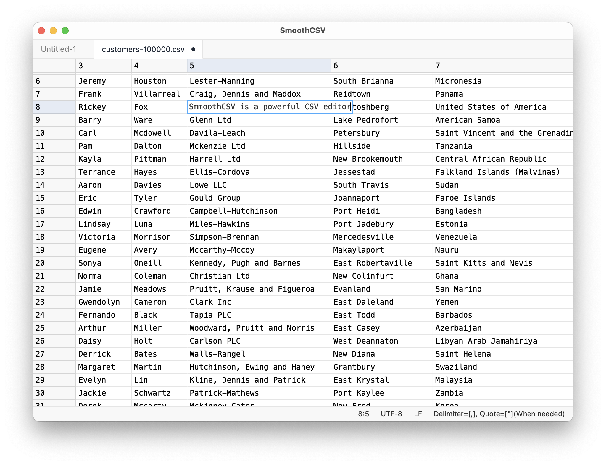
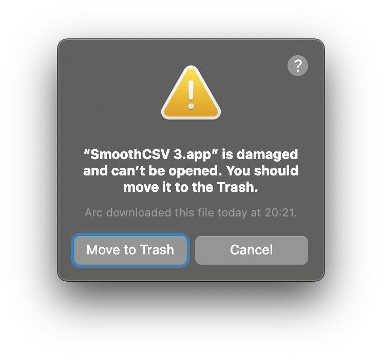

# SmoothCSV 3

SmoothCSV 3 is the next generation of [SmoothCSV](https://github.com/kohii/smoothcsv), featuring a new UI, new functionalities, and updated technologies.



## Status

This project is currently a work in progress.

The source code is not yet public.
(I have not decided whether it will be open-source.)

## Download

An alpha version is available for testing.
You can download it from the [releases](https://github.com/kohii/smoothcsv3/releases) page.
At the moment, only macOS is supported.

Please note that the alpha version may contain bugs and might not be stable. Use it at your own risk.

Report any bugs or feature requests via the [issue tracker](https://github.com/kohii/smoothcsv3/issues).

<details>
<summary>If you cannot open the app because it is damaged</summary>

<p align="center">
  
</p>

1. Open the Terminal app.
2. Run the following command.

```bash
xattr -r -d com.apple.quarantine "/Applications/SmoothCSV 3.app"
```
</details>

<details>
<summary>If you cannot open the app because the developer cannot be verified</summary>

1. Open the `System Settings` app and go to `Security & Privacy`.
2. Click the `Open Anyway` button.

If the `Open Anyway` button doesn't appear, follow these steps:

1. Open the Terminal app.
2. Run the following command:

```bash
xattr -r -d com.apple.quarantine "/Applications/SmoothCSV 3.app"
```

</details>

## Roadmap

- [x] Alpha release
  - [x] Implement basic functionality (file read/write, editing, undo/redo, copy/paste, find/replace, command palette, etc.)
- [ ] Beta release
  - [ ] Rename and rebrand the app
  - [ ] Implement all features from the original SmoothCSV
  - [ ] Build a website
  - [ ] Add an updater
  - [ ] Implement settings
  - [ ] Localize for Japanese
  - [ ] Add Windows support
  - [ ] Implement dark mode
- [ ] Stable release
  - [ ] Pay $99 for Apple Developer Program
  - [ ] Launch on Product Hunt
  - [ ] Add localization for other languages
  - [ ] Improve performance
  - [ ] Enhance stability
- [ ] Future plans
  - [ ] Develop an extension system
  - [ ] Open-source the project
  - [ ] Support additional file formats
  - [ ] Integrate AI assistance

I aspire for this app to eventually be considered the "VSCode of tabular editors."

## Support ❤️

If you like this project and would like to support me, you can help by:

[](https://www.buymeacoffee.com/kohii)
