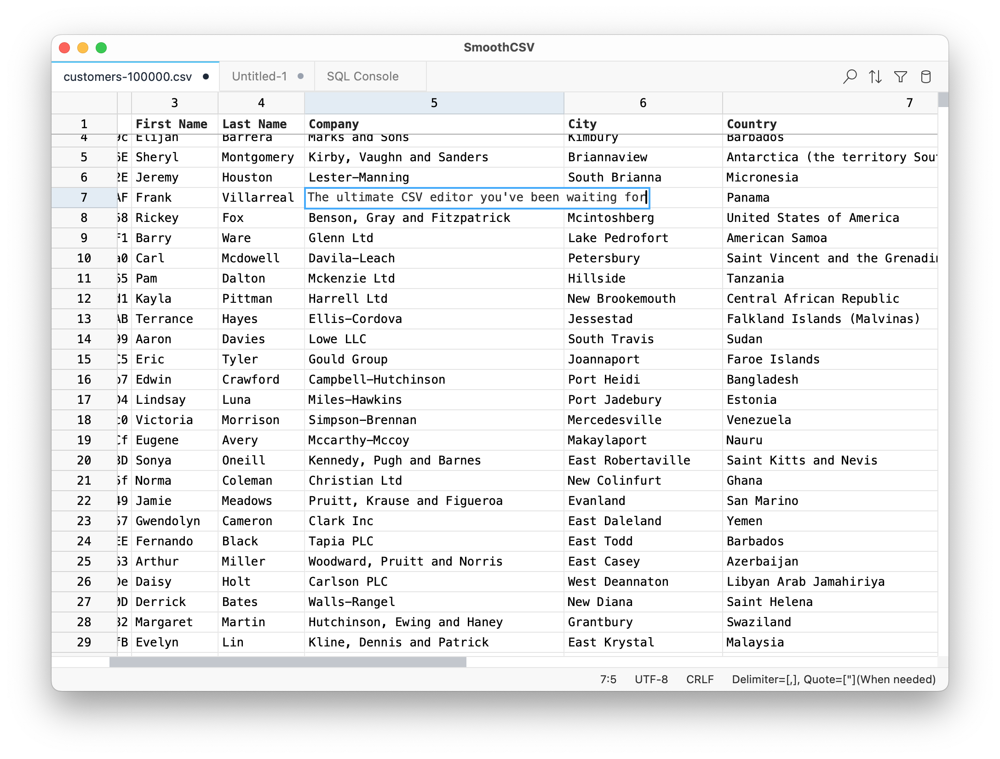

# SmoothCSV 3

SmoothCSV 3 is the ultimate CSV editor for macOS and Windows.

**Website:** [smoothcsv.com](https://smoothcsv.com)

## About This Repository

The source code is not yet public (I haven't decided whether it will be open-source or not).

This repository is used for issue tracking and release management.

## Download

Download the latest version from the [releases](https://github.com/kohii/smoothcsv3/releases) page.

Report bugs or request features via the [issue tracker](https://github.com/kohii/smoothcsv3/issues).

## Roadmap

- [x] **Alpha Release**
  - [x] Implement basic functionality (file read/write, editing, undo/redo, copy/paste, find/replace, command palette, etc.)
- [x] **Beta Release**
  - [x] Add Windows support
  - [x] Rebrand the app
  - [x] Add an updater
  - [x] Pay $99 for Apple Developer Program
  - [x] Localize for Japanese, Spanish, Chinese-Simplified
- [x] **Stable Release**
  - [x] Implement all features from the original SmoothCSV
  - [x] Add a toolbar
  - [x] Build a website
  - [x] Implement settings
  - [x] Launch on Product Hunt
  - [x] Improve performance
- [ ] **Coming Soon**
  - [ ] Implement dark mode
  - [ ] Add Linux support
- [ ] **Future Plans**
  - [ ] Develop an extension system
  - [ ] Open-source the project
  - [ ] Support additional file formats
  - [ ] Integrate AI assistance

*My aspiration is for this app to eventually be considered the "VS Code of tabular editors."*

## Support ❤️

If you like this project and would like to support me:

**Also, please:**
- ⭐ Star this repository
- 🐦 Follow me on X for updates:
  - English: [@kohiidev](https://x.com/kohiidev)
  - Japanese: [@kohii00](https://x.com/kohii00)
