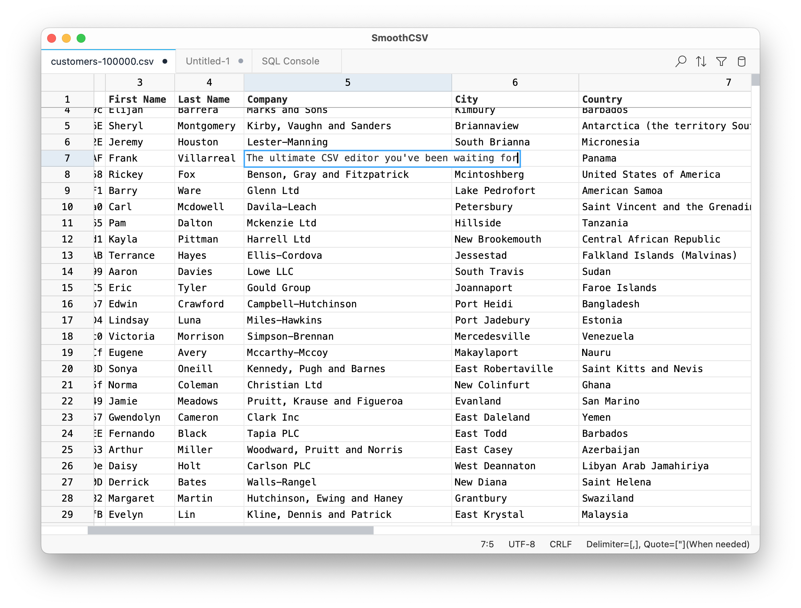

# SmoothCSV

  

  The ultimate CSV editor you've been waiting for.

  <a href="https://smoothcsv.com">Website</a> •
  <a href="https://github.com/kohii/smoothcsv3/tree/main/docs">Documentation</a> •
  <a href="https://github.com/kohii/smoothcsv3/issues">Bug Reports or Feature Requests</a>

  

## Introduction

SmoothCSV is a cross-platform CSV editor built for real work.
Edit your files intuitively, exactly how you want.
Lightning-fast performance, handles messy data, and powerful features like SQL queries.
Just smooth CSV editing that works.

*My aspiration is for this app to eventually be considered the "VS Code of tabular editors."*

## Features

- **Power Grid Editor**: Intuitive and performant editing with spreadsheet-like UI.
- **Row/Column Tools**: Insert, delete, move, hide, dedupe.
- **Find & Replace**: Search and replace with regex support.
- **Filtering**: SQL-style filters or a visual condition builder.
- **Sorting**: Single or multi-column sorting by text, number, date, length.
- **Multi-Cell Edit**: Edit multiple cells simultaneously, similar to multi-cursor editing.
- **SQL Console**: Run SELECT queries on CSV files.
- **Header Tools**: Detect or set custom headers for structure.
- **Text Transforms**: Instant casing and naming conversions.
- **Join & Split**: Merge or split cells horizontally/vertically
- **Copy/Paste As**: Export selections as Markdown, HTML, JSON, SQL, LaTeX, etc.
- **Excel Import/Export**: Open and save `.xlsx` files.
- **Customizable File Formats**: Per-file delimiter, quotes, encoding, line endings.
- **Themes**: Light or dark with system auto-detect.
- **Localization**: English, Japanese, Spanish, Italian, Simplified Chinese.
- **CLI**: Launch files and jump to any row/column.
- **Deep Link**: Open files with `smoothcsv://` URLs.
- **Auto-fill**: Drag-fill cells with intelligent pattern detection.
- **Cell Value Panel**: Docked editor akin to Excel’s formula bar.
- **Auto-backup**: Automatically backup files before overwriting.
- **File Format Presets & Rules**: Define custom file formats and rules for automatic application.
- **Quick Filters & Sorting in Column Menu**: Quick access to column-specific actions.
- **Command Palette**: Quick access to all features.

## About This Repository

The source code is not yet public (I haven't decided whether it will be open-source or not).  
This repository is used for issue tracking and release management.

## Download

Download the latest version from the [releases](https://github.com/kohii/smoothcsv3/releases) page.  
Report bugs or request features via the [issue tracker](https://github.com/kohii/smoothcsv3/issues).

## Roadmap

- [x] **Alpha Release**
  - [x] Implement basic functionality (file read/write, editing, undo/redo, copy/paste, find/replace, command palette, etc.)
- [x] **Beta Release**
  - [x] Add Windows support
  - [x] Rebrand the app
  - [x] Add an updater
  - [x] Pay $99 for Apple Developer Program
  - [x] Localize for Japanese, Spanish, Chinese-Simplified
- [x] **Stable Release**
  - [x] Implement all features from the original SmoothCSV
  - [x] Add a toolbar
  - [x] Build a website
  - [x] Implement settings
  - [x] Launch on Product Hunt
  - [x] Improve performance
- [x] **Coming Soon**
  - [x] Implement dark mode
  - [x] Add Linux support
- [ ] **Future Plans**
  - [ ] SmoothCSV in Browser
  - [ ] Develop an extension system
  - [ ] Diff viewer
  - [ ] Open-source the project
  - [ ] Support additional file formats (like JSON, Avro, Parquet, etc.)
  - [ ] Integrate AI assistance

## Support ❤️

If you like this project and would like to support me:

**Also, please:**
- ⭐ Star this repository
- 🐦 Follow me on X for updates:
  - Official updates: [@smoothcsv](https://x.com/smoothcsv)
  - Author (Japanese): [@kohii00](https://x.com/kohii00)
